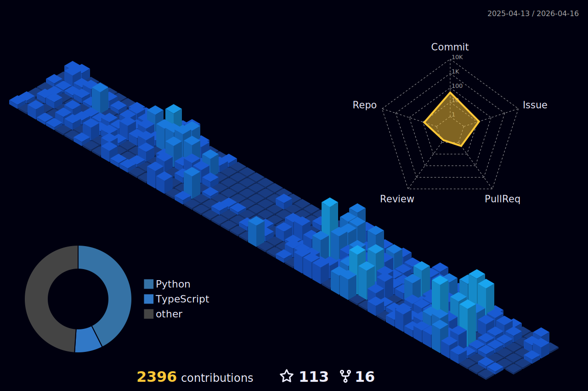

  

&nbsp;

&nbsp;

---

<!-- ═══════════════════════════════════════════ -->
<!--                 ABOUT ME                    -->
<!-- ═══════════════════════════════════════════ -->

##  About Me

> Machine Learning Engineer specializing in building robust production ML systems, with expertise in computer vision, audio processing, and generative diffusion models. I focus on optimizing inference for speed and efficiency, maximizing hardware potential, and ensuring seamless scalability.

<table>
<tr>
<td width="50%" valign="top">

### Currently
**Founding Engineer @ [Dreamflux](https://dreamflux.ai)**
- AI-driven characters with layered memory structures
- Multi-agent environments with spatial intelligence
- Long-term contextual retention research

### Previously
**ML Engineer @ Playjump** — Serverless diffusion & video pipelines
**Aluminus @ [Lossfunk](https://lossfunk.com/) ** Video SuperResolution and Agents

</td>
<td width="50%" valign="top">

### Active Research
- **ComfyUI Extensions**
- **Multi Agent Systems
- **Memory Systems** 
- **3D Avatar Generation** 
- **Shader Generation**

</td>
</tr>
</table>

---

<!-- ═══════════════════════════════════════════ -->
<!--                TECH STACK                   -->
<!-- ═══════════════════════════════════════════ -->

##  Tech Stack

<table>
<tr>
<td align="center" width="33%">

**Languages**

</td>
<td align="center" width="33%">

**ML & AI**

</td>
<td align="center" width="33%">

**Frontend**

</td>
</tr>
<tr>
<td align="center" colspan="3">

**Infrastructure & MLOps**

</td>
</tr>
</table>

---

<!-- ═══════════════════════════════════════════ -->
<!--               GITHUB STATS                  -->
<!-- ═══════════════════════════════════════════ -->

##  GitHub Stats

&nbsp;

 

 

&nbsp;

 

---

<!-- ═══════════════════════════════════════════ -->
<!--            CONTRIBUTION ACTIVITY            -->
<!-- ═══════════════════════════════════════════ -->

##  Contribution Activity

### 3D Contribution Calendar

<picture>
  <source media="(prefers-color-scheme: dark)" srcset="./profile-3d-contrib/profile-night-view.svg" />
  <source media="(prefers-color-scheme: light)" srcset="./profile-3d-contrib/profile-green-animate.svg" />
  
</picture>

  

### Activity Graph

 

### Contribution Snake

<picture>
  <source media="(prefers-color-scheme: dark)" srcset="https://raw.githubusercontent.com/VikramxD/VikramxD/output/github-snake-dark.svg" />
  <source media="(prefers-color-scheme: light)" srcset="https://raw.githubusercontent.com/VikramxD/VikramxD/output/github-snake.svg" />
  
</picture>

---

<!-- ═══════════════════════════════════════════ -->
<!--                 TROPHIES                    -->
<!-- ═══════════════════════════════════════════ -->

---

<!-- ═══════════════════════════════════════════ -->
<!--                  FOOTER                     -->
<!-- ═══════════════════════════════════════════ -->

  

&nbsp;

&nbsp;

